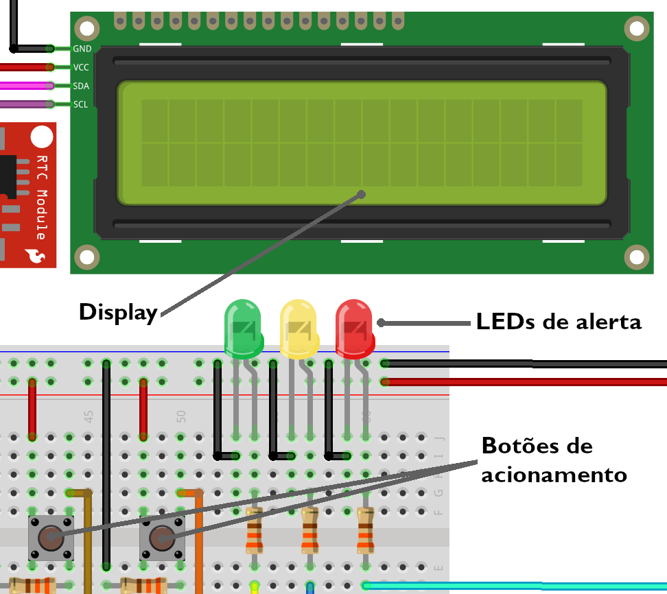
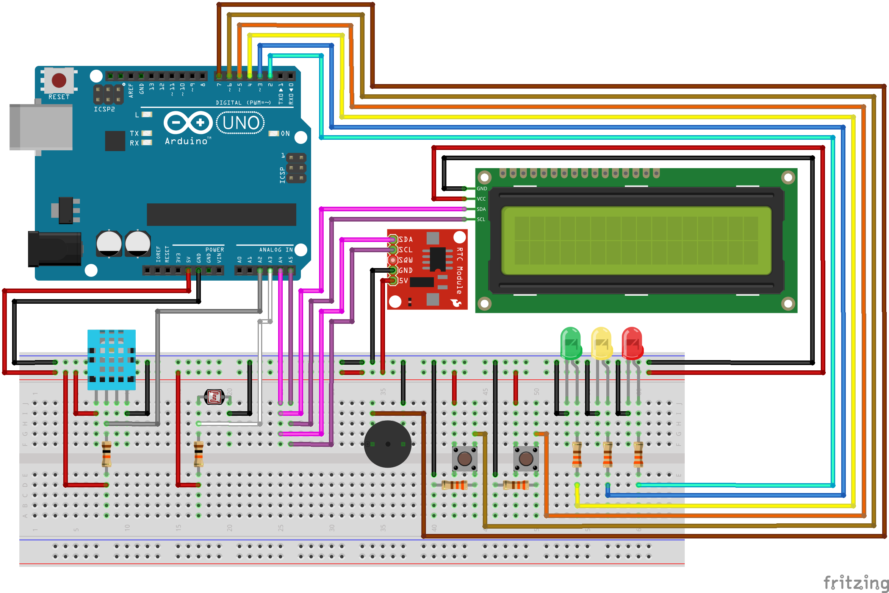
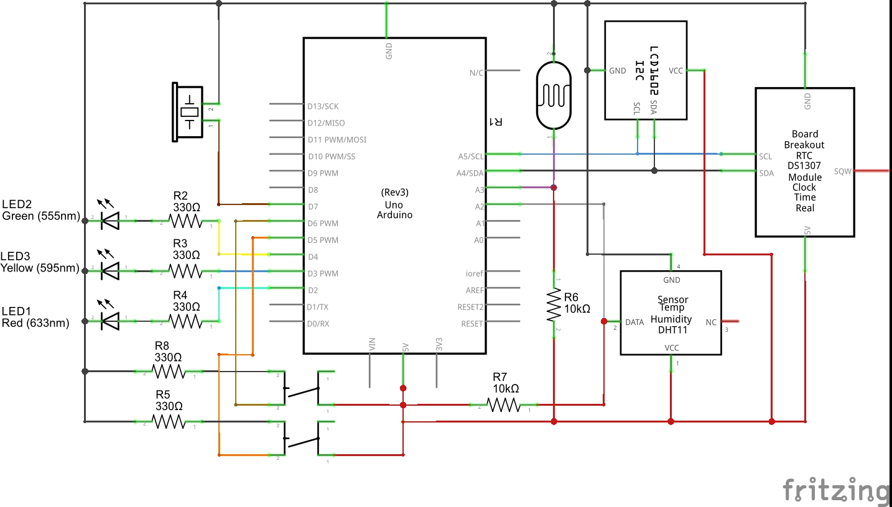

## Índice

1. [Sobre](#sobre)
2. [Objetivo](#objetivo)
3. [Especificações técnicas](#especificações-técnicas)
   1. [Materiais utilizados](#materiais-utilizados)
   2. [Funcionalidade](#funcionalidade)
4. [Manual de operação do Data Hopper](#manual-de-operação-do-data-hopper)
   1. [Configuração inicial](#configuração-inicial)
   2. [Modo de medição](#modo-de-medição)
   3. [Modo de pausa](#modo-de-pausa)
6. [Montagem do projeto e seu diagrama elétrico](#montagem-do-projeto-e-seu-diagrama-elétrico)
   1. [Montagem](#montagem)
   2. [Diagrama](#diagrama)

## Sobre
Data Hopper é um dispositivo baseado na plataforma Arduino UNO R3 capaz de medir e apresentar ao usuário os valores médios de luminosidade, temperatura e umidade de um ambiente industrial a qual estiver inserido em um display, além de armazenar e apresentar os instantes em que os valores estiverem fora dos intervalos especificados, capaz de guardar até 92 registros.

## Objetivo
O objetivo principal é realizar padronizadamente o monitoramento das condições ambientais, permitindo calcular a média ponderada, estabelecer níveis de referência e alertar de forma sonora e visual discrepâncias das variáveis monitoradas.

## Especificações técnicas
### Materiais utilizados
| Quantidade | Componente                                         |
|------------|----------------------------------------------------|
| 1          | Piezo Buzzer                                       |
| 1          | LCD1602-I2C                                        |
| 1          | Arduino Uno (Rev3)                                 |
| 1          | DS1307 RTC (v1.1)                                  |
| 1          | LED Vermelho                                       |
| 1          | LED Amarelo                                        |
| 1          | LED Verde                                          |
| 1          | DHT11 (Sensor de Umidade e Temperatura)            |
| 1          | LDR (fotocélula)                                   |
| 5          | Resistor (330Ω)                                    |
| 2          | Resistor (10kΩ)                                    |
| 2          | Pushbutton                                         |

## Funcionalidade
O dispositivo é capaz de medir e exibir os valores médios de luminosidade, temperatura e umidade em um display. Com a ação de um EEPROM Data Logger, ele lê e armazena os instantes em que os valores estão fora dos intervalos especificados, fornecendo controle sobre as condições ambientais. Casos os valores de referência sejam ultrapassados ou não atingidos pelo sensor DHT-11, será acionado um alarme sonoro (buzzer) para alertar a discrepância e um ou mais LEDs serão acesos para indicar a leitura discrepante.

## Manual de operação do Data Hopper

A navegação do dispositivo dispõe-se do uso de dois botões acionáveis e um display LCD para exibir as informações processadas ao usuário. O dispositivo possui três modos disponíveis, a __configuração inicial__ ao ser inicializado, o __modo de medição__ e o __modo de pausa__.

### Configuração inicial
A __configuração inicial__ permite ao usuário alternar entre a exibição das informações: a escala de temperatura e o idioma. As opções podem ser alternadas pelo acionamento do primeiro botão e serem confirmadas com o segundo. As linguagens disponíveis são Inglês, Espanhol e Português, e as escalas de temperatura disponíveis são Kelvin, Celsius ou Fahreinheit.

### Modo de medição
O __modo de medição__ é responsável por apresentar os valores atuais medidos pelos sensores, após a __configuração inicial__. O segundo botão alterna com o __modo de pausa__.

### Modo de pausa
O __modo de pausa__ permite verificar os instantes com valores discrepantes armazenados na EEPROM, sendo possível verificar de maneira automática ou manual (de registro em registro). O primeiro botão seleciona a _verificação automática_, e o segundo botão a _verificação manual_.
Durante a leitura da EEPROM, o primeiro botão é usado para prosseguir ao próximo registro (manual), e o segundo é utilizado para sair do __modo de pausa__. Isso é feito pressionando e segurando o botão, tanto na verificação manual quanto automática.
Pressionando e segurando ambos os botões por 5 segundos realiza a restauração do sistema e do Data Logger, eliminando todos os registros.

## Montagem do projeto e seu diagrama elétrico

### Montagem

Veja a montagem

### Diagrama

Veja o diagrama elétrico

